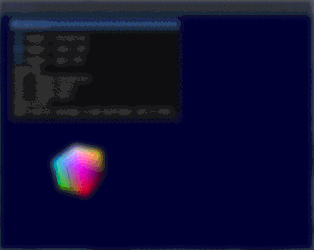

# PA2: Interaction

# Dependencies, Building, and Running

## Dependency Instructions
For both of the operating systems to run this project installation of these three programs are required [GLEW](http://glew.sourceforge.net/), [GLM](http://glm.g-truc.net/0.9.7/index.html), and [SDL2](https://wiki.libsdl.org/Tutorials).

This project uses OpenGL 3.3. Some computers, such as virtual machines in the ECC, can not run this version. In in order to run OpenGL 2.7 follow the instructions at [Using OpenGL 2.7](https://github.com/HPC-Vis/computer-graphics/wiki/Using-OpenGL-2.7)

### Ubuntu/Linux
```bash
sudo apt-get install libglew-dev libglm-dev libsdl2-dev libglfw3-dev
```

### Mac OSX
Installation of brew is suggested to easily install the libs. Ensure that the latest version of the Developer Tools is installed.
```bash
brew install glew glm sdl2
```

## Building and Running
### CMake Instructions
The building of the project is done using CMake, installation with apt-get or brew may be necessary. 
```bash
mkdir build
cd build
cmake ..
make
./Tutorial -f ../shaders/defaultFragmentShader.glsl -v ../shaders/defaultVertexShader.glsl
```

### Shortcuts
MB1 off menu - Toggle Direction  
[A] - Toggle Spin Direction  
[S] - Toggle Orbit Direction  
[Z] - Toggle Spin   
[X] - Toggle Orbit  

## ECC, overriding openGL version
```bash
Since we are likely not using new features of OpenGL
mkdir build
cd build
cmake ..
make
export MESA_GL_VERSION_OVERRIDE=3.3
# !! If in ECC or remote Linux instance prepend vglrun
./Tutorial -f ../shaders/defaultFragmentShader.glsl -v ../shaders/defaultVertexShader.glsl
```


## Documentation

### Event Handler
The event handle class will allow listeners to subscribe to various key presses. This allows runtime and dynamic lists of different subscribers to be notified when needed. This used to have a general way for the menu class and GLFW inputs to work together nicely. Neither affect the object directly and rather notify all listeners of the object in event a key was pressed. This also means reduced code duplication when trying to enlist multiple listeners to the subscriber list for a certain key. This listener class is pure virtual requiring the derived listener to implement handleEvent in some manner. This follows with the design pattern Observer (pub/sub) and can handle generics.
```c++
class Listener {
public:
  virtual void handleEvent(int key) = 0;
  virtual void handleEvent(int key, float *val);
};

class EventHandler {
private:
  // Key - KEY; Value - List<Listener>
  std::unordered_map<int, std::vector<Listener*>> listeners;
public:
  EventHandler();
  ~EventHandler();
  void subscribe(int key, Listener *listener);
  void unsubscribe(int key, Listener *listener);
  void notify(int key);
  template <class T>
  void notify(int key, T *val);
};
```
#### Adding a new key
Adding a new key will require subscribing listeners to a key defined by GLFW. The callback is handled by GLFWSetKeyCallback() and GLFWSetMouseButtonCallback() which takes a reference to a pointer and a callback function. The callback functions are defined in a lambda and a reference pointer is made to the current object using GLFWGetWindowUserPointer(window). This returns a void pointer which is casted into the type of the this object. We can then use that callback to run EventHandler::notify(key) and each object subscribed will react accordingly. This is also done in the Menu class, which will notify once a button is pressed.
```c++
// Composition -> Object (Listener)
// Subscribe listener object to a key
eventHandler.subscribe(GLFW_KEY_A, object)
// or
eventHandler.subscribe(GLFW_KEY_A, this)
...

// Bind GLFW Input to Event Handler
GLFWSetKeyCallback(m_window->getGLFWwindow(), [](GLFW *window, int button, int action, int mods) 
{
  Engine *engine = reinterpret_cast<Engine *>(glfwGetWindowUserPointer(window));
  if (!engine) return;
  if (action == GLFW_PRESS) {
    case (key) {
      case GLFW_KET_A:
        engine->m_eventHandler->notify(GLFW_KEY_A);
    }
  }
}

// Inheritance <- Listener (Object)
handleEvent(int key){
  switch (key) {
    case GLFW_KEY_A:
      do_something();
  }
}
...
```

### Menu
The Menu class is a listener for the event handler but also notifies when its input is changed. This means that it will have a feedback loop as notify the objects will in turn notify itself. This requires each toggle option to then cancel out the state change by reversing the state. This is a requirement only if sharing the same input as GLFW, since there are two sources of notification. Listener class also requires virtual float-specific notify to work with slider.

### ArgWrapper
The ArgWrapper class handls everything dealing with command-line arguments. Each command line argument is saved in a struct (Args) which will be initialized in main and a shared pointer between all inherited classes will be able to access the arguments. It also prints usage information in a similar structure to popular Linux commands and processes args into the Arg struct.
```c++
struct Args {
  char *vertexShaderPath;
  char *fragmentShaderPath;
};

class ArgWrapper {
public:
  ArgWrapper(Args *args);
  ~ArgWrapper();
  static bool processArgs(int &argc, char **argv, Args *args_out);
  static void printUsage();
protected:
  Args *m_args;
};
```

### Object3D
The Object3D class tries to take what remains the same between 3D objects so that different models can be instanced with their own logic by deriving from this class. It handles name, id, parent/children hierarchy (for inherited transforms), and common matrices. Still mostly to be implemented but it provides a clear structure to deal with multiple objects in the future.
